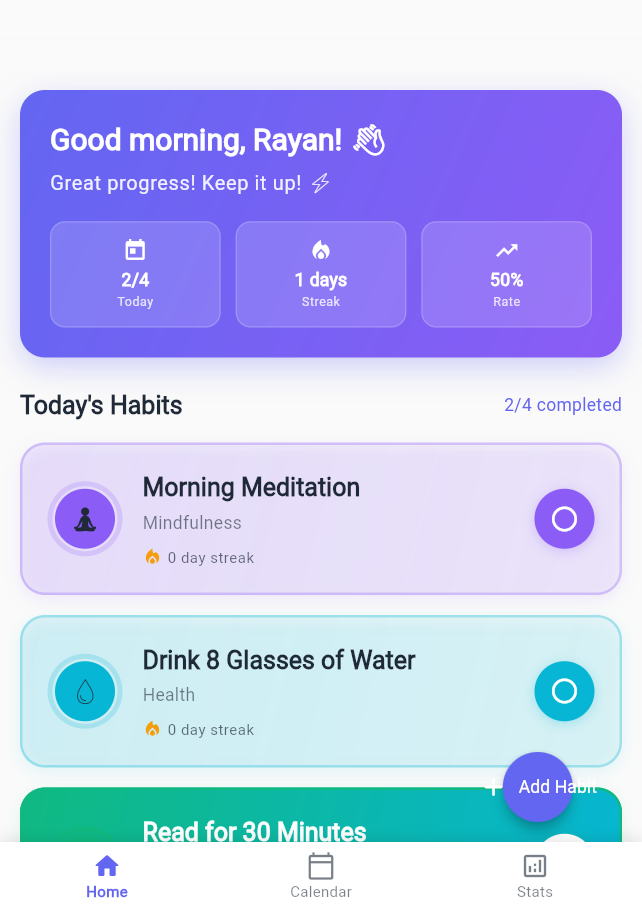
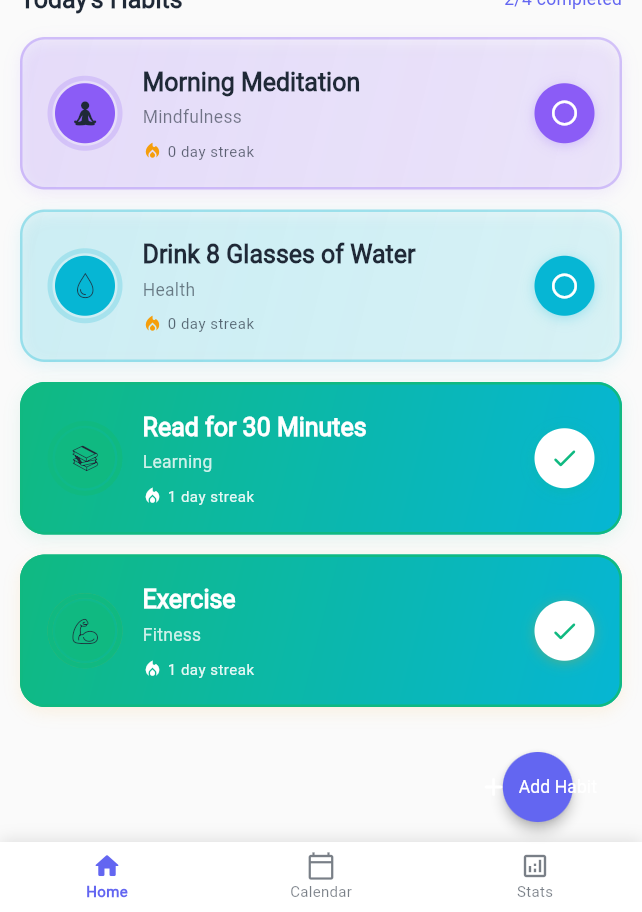
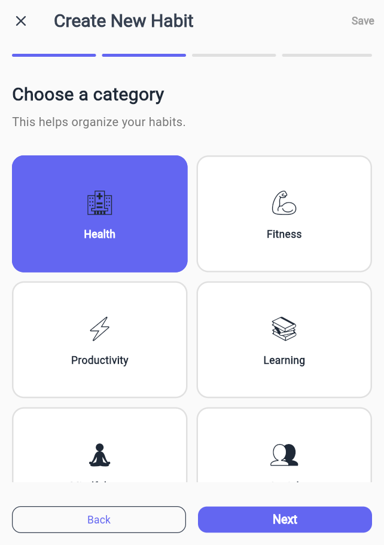
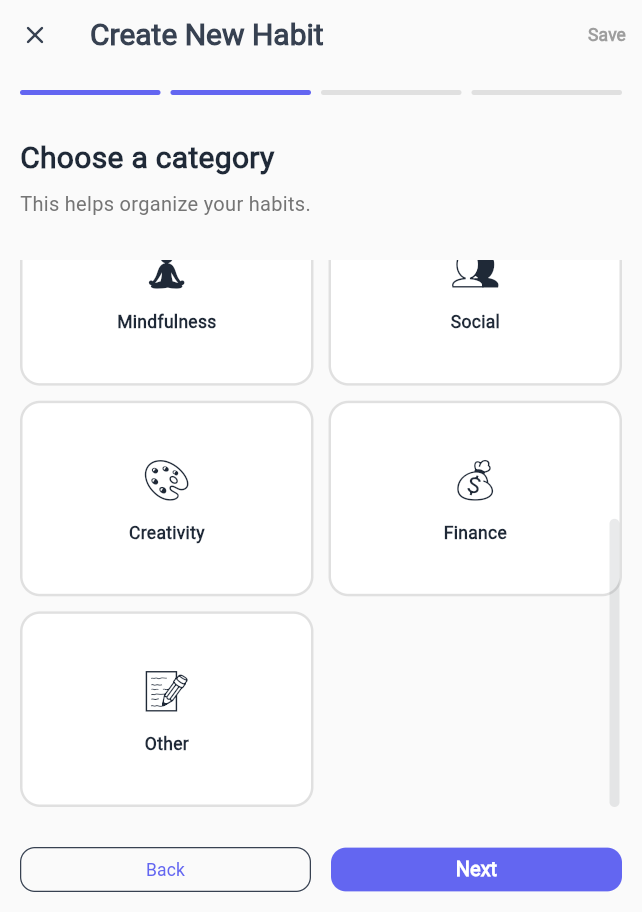
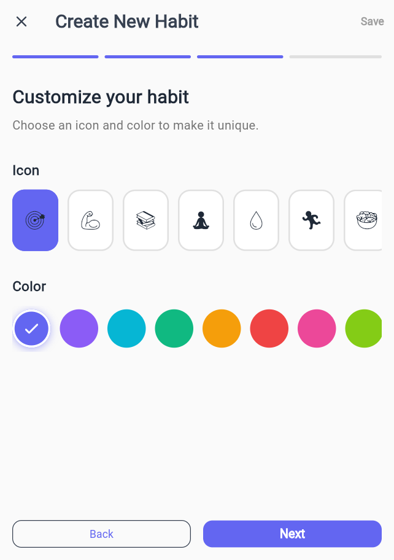
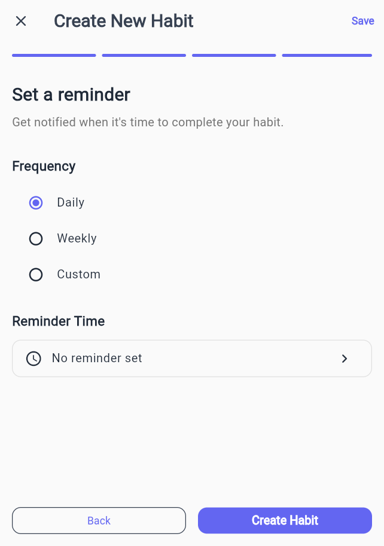
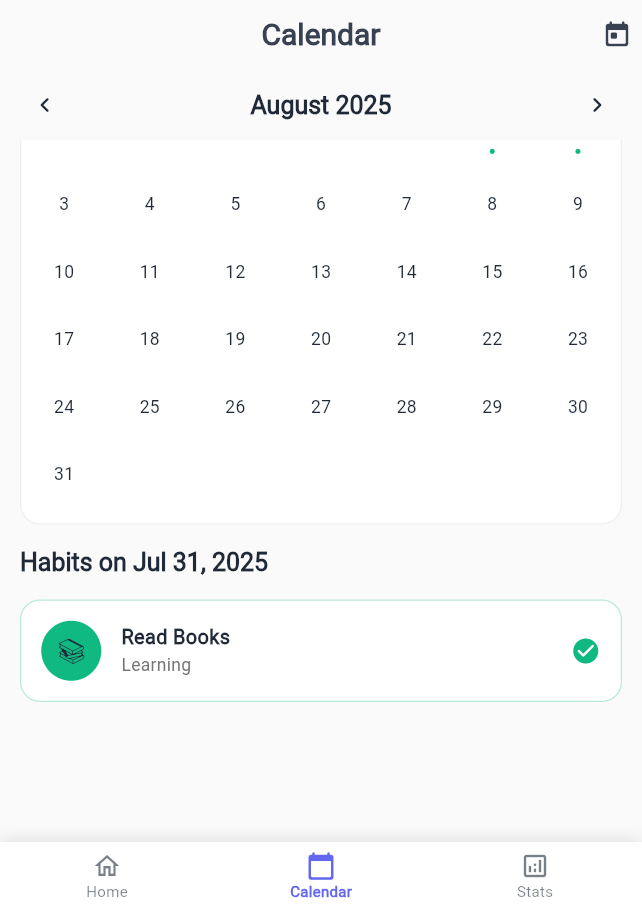
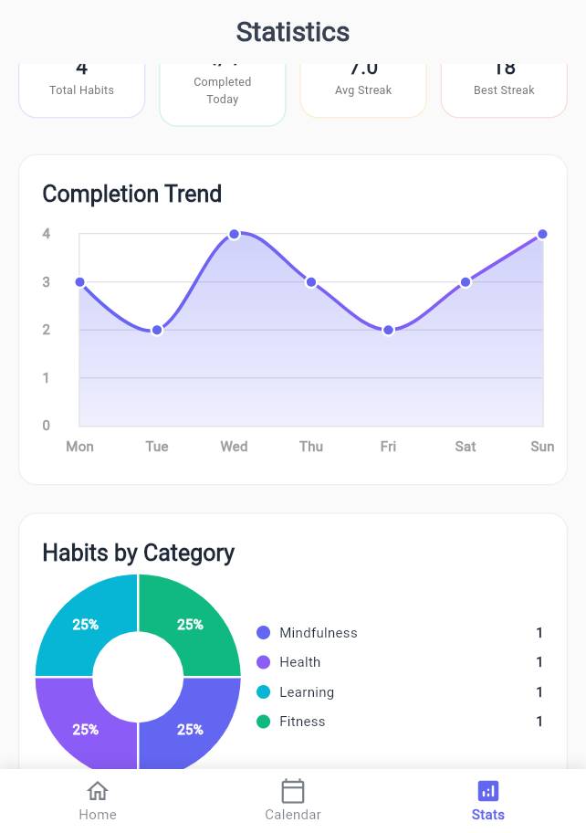
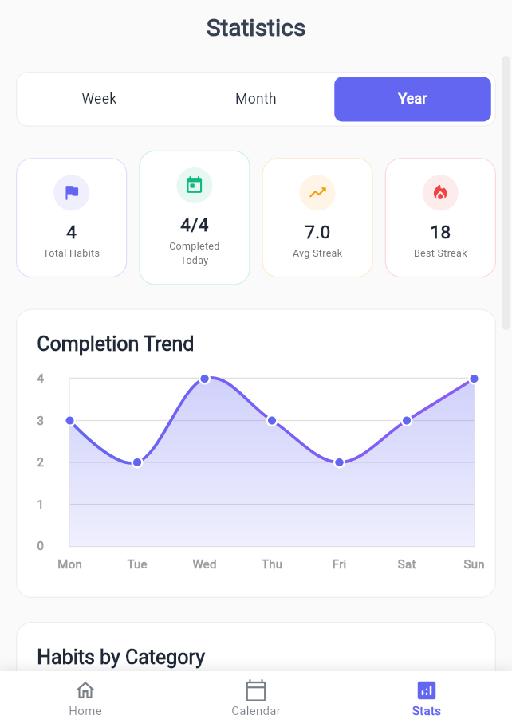

# 🌱 HabitFlow – Modern Habit Tracker App

A clean, animated, and minimal habit-tracking app built with Flutter.

---

## ✨ Features
- Create & track habits
- Animated progress rings
- Calendar view with completion history
- Streak tracking & stats dashboard
- Light/Dark mode with smooth UI

---

## 📱 Screenshots

### 🏠 Home Screen  
  


---

### ➕ Add Habit  
  
  
  
  


---

### 📆 Calendar  


---

### 📊 Stats  
  


---

## 🚀 Getting Started
```bash
git clone <repo-url>
cd habitflow_app
flutter pub get
flutter run
